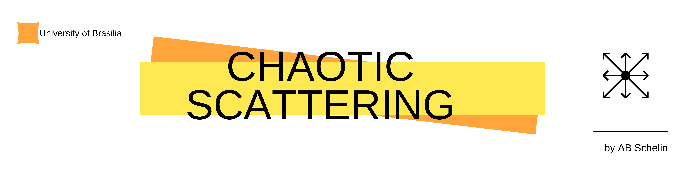
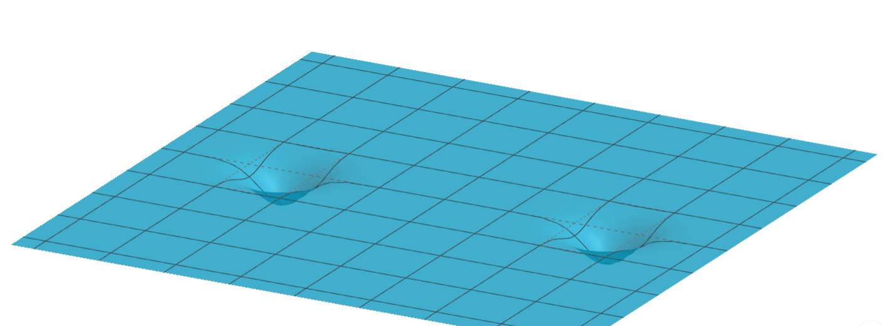

  

# Chaotic Scattering

In this work we simulate different scattering systems that exhibit chaos. 

# Systems

* [Double gaussian potential](https://github.com/aschelin/Chaotic-Scattering/blob/master/basin2gauss_classical.py)

  

